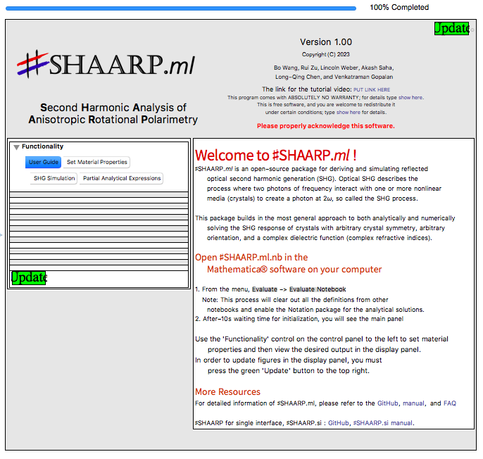
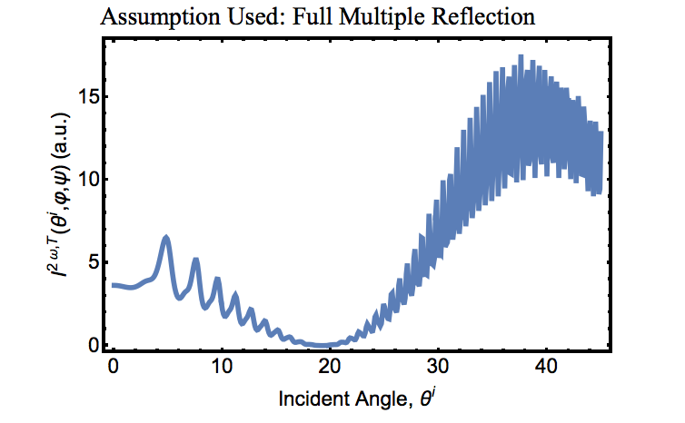
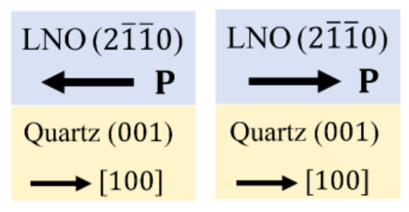
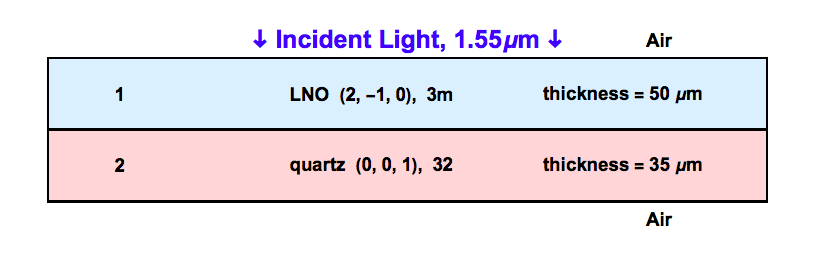
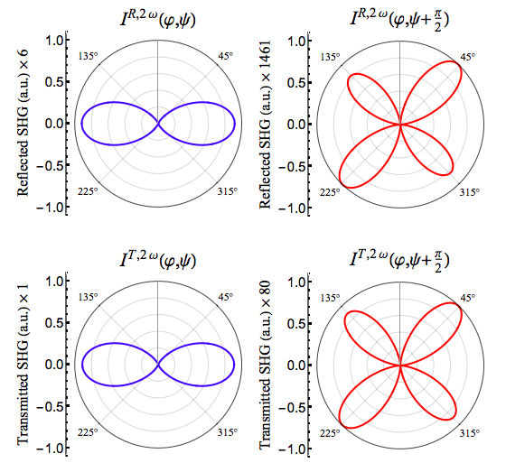
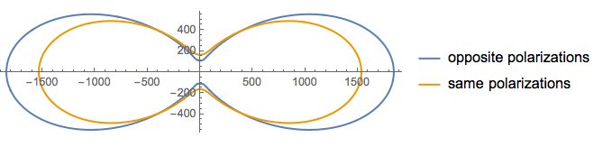

Maker fringes

The following tutorial demonstrates the calculation of Maker fringes for a multilayer composed of Z-cut quartz with a gold layer deposited at the back of the slab. This example has been presented in the manuscript and highlights the importance of multiple reflections. 

We start by discussing the experimental details before proceeding to simulate the Maker fringes pattern. The multilayer comprises of a 121.2 $\mu$m thick Z-cut quartz with a 13.9 nm gold coating at the back. The fundamental wave is p-polarized and it's wavelength is set to 800 nm in air and the p-polarized SHG intensities are measured. Now, we discuss the simulation part below.

- Open `SHAARP.ml_Vx.xx.nb` in _Mathematica®_. Evaluate the notebook by clicking `Evaluation > Evaluate Notebook`. Ensure that Dynamic Evaluation is enabled in _Mathematica®_. If everything goes right, the user guide should be visible in the notebook as shown below.

   
   In case the above is not seen, please re-evaluate the notebook or restart _Mathematica®_ and try again.

-  In the functionality sub-panel of the input panel on the left, click `Set Material Properties` to define the multilayer.

- Set the wavelength to 0.8 $\mu$m (800 nm) from the wavelength setting sub-panel.

- In the `Material Selection` sub-panel, type 2 for the number of layers. 

- Click on `1` to edit the first layer of the multilayer. Give it a suitable name, say "Z-cut quartz". The crystal and optical properties of quartz are already pre-defined and saved as an example. To apply these properties, click on `Quartz (001)` from the case study sub-panel.

- From the `Material thickness` sub-panel, enter 121.2 ($\mu$m) to set the thickness of the quartz slab. Since the crystal and optical properties of quartz are already defined, nothing needs to be changed in the crystal structure, crystal orientation, dielectric tensors and SHG tensor sub-panels.
!!! note
	   In general, the user would need to manually enter the crystal and optical properties of the layer. See the Input Panel section of the manual for more details and instructions.

- Having defined the properties for quartz, now click `2` in the material selection sub-panel to set the properties of the gold layer. Give it a suitable name, say "gold" and click `Au coating` from the case study sub-panel. Now set the thickness to 0.0139 (13.9 nm). The other properties for the gold layer have already been provided. In general, the user would need to enter the values corresponding to the crystal and optical properties.

- Now click on `Update` to visualize the multilayer that has been defined. It should look like the figure below. 

   

   The figure below the multilayer shows the relative orientation of the $Z_1 Z_2 Z_3$ axes of the selected layer with respect to the lab coordinate system $L_1 L_2 L_3$. From the functionality sub-panel, click on `3D Schematics` to see this as an interactive 3D figure.

- Now click on `SHG Simulation` in the functionality sub-panel to define the experimental setup. Check  `Generate Maker Fringes Plot` to calculate the Maker Fringes pattern.

- Select the assumption to use. By default, ♯SHAARP._ml_ uses full multiple reflections.

- In the Maker fringes collection settings, enter the incident angle range for the Maker fringes simulation. We shall simulate the pattern for incident angles between 0$^{\circ}$ and 45$^{\circ}$. To do this, set the minimum incident angle to 0 and maximum incident angle to 45. This can be done by either dragging the sliders, clicking on the angle button or manually entering the angle.

- Set the scan step size to 0.1$^{\circ}$ to see the intensity oscillations clearly. 

- As already described in the experimental setup above, the incident fundamental light is p-polarized and the p-polarized SHG intensity is to be recorded. Hence, set the polarizer angle $\varphi$ as well as the analyzer angle $\psi$ to 0. The incident ellipticity is 0 since the light is linearly polarized.

- Now click on `Update` to start the simulation. This shall take a few minutes due to the small step size. The simulated Maker fringes pattern should look as shown below.

    

One can now try changing the thickness of the slab by 1 $\mu$m to see the effect of the slab thickness on the Maker fringes pattern. To do this, go back to the `Set Material Properties` and click on `1` to modify the quartz layer. Change the thickness and click `Update`. Now click on `SHG Polarimetry` and click `Update` again to run the Maker fringes simulation for the new thickness.

## SHG Polarimetry

In this section, we show how two SHG active layers can be used to determine the spontaneous polarization by SHG interference contrast. The experimental setup consists of a 50 $\mu$m layer of LiNbO3 ($2 \bar{1} \bar{1} 0$) crystal on 10 $\mu$m (001) quartz. The fundamental light has a wavelength of 1550 nm and is incident on the multilayer normally. The polarization of the fundamental light is varied and the p-polarized SHG intensity is recorded. To set the direction of the spontaneous polarizations (along c axis), it is easier to specify the orientation using the crystal physics coordinate system $Z_1 Z_2 Z_3$. 

- Open `SHAARP.ml_Vx.xx.nb` in _Mathematica®_. Evaluate the notebook by clicking `Evaluation > Evaluate Notebook`. Ensure that Dynamic Evaluation is enabled in _Mathematica®_. If everything goes right, the user guide should be visible in the notebook. In case the user guide is not seen, please re-evaluate the notebook or restart _Mathematica®_ and try again.

- In the functionality sub-panel of the input panel on the left, click `Set Material Properties` to define the multilayer.

- Set the wavelength to 1.55 $\mu$m (1550 nm) from the wavelength setting sub-panel.

- In the material selection sub-panel, type 2 for the number of layers.  

- Click on `1` to edit the first layer of the multilayer. Give it a suitable name, say "LNO". The crystal structure and optical properties of LiNbO3 are already pre-defined and saved as an example. To apply these properties, click on LiNbO3 (0001) from the `Case Study` sub-panel.

- From the `Material thickness` sub-panel, enter 50 ($\mu$m) to set the thickness of the LiNbO3 slab. Since the crystal structure and optical properties of LiNbO3 are already defined, nothing needs to be changed in the crystal structure, dielectric tensors and SHG tensor sub-panels. 

!!! note
	In general, the user would need to manually enter the crystal and optical properties of the layer. See the Input Panel section of the manual for more details and instructions.

- To define the orientation of the LiNbO3 crystal, click on `Use Crystal Physics Direction` in the crystal orientation sub-panel. For the spontaneous polarization of LiNbO3 to be oriented along the polarization vector for quartz, the crystal physics vectors in the lab coordinate system take the following values: $Z_1 = (0,0,1)$, $Z_2=(0,-1,0)$ and $Z_3=(1,0,0)$. 

- Having defined the properties for LiNbO3, now click `2` in the material selection sub-panel to set the properties of the quartz layer. Give it a suitable name, say "quartz" and click `Quartz (001)` from the case study sub-panel. Now set the thickness to 10 ($\mu$m). The other properties for the quartz layer have already been provided. In general, the user would need to enter the values corresponding to the crystal and optical properties.

- Now click on `Update` to visualize the multilayer that has been defined. It should look like the figure below. 

    
The figure below the multilayer shows the relative orientation of the $Z_1 Z_2 Z_3$ axes of the selected layer with respect to the lab coordinate system $L_1 L_2 L_3$. From the functionality sub-panel, click on `3D Schematics` to see this as an interactive 3D figure.

- Click on `SHG Polarimetry` in the functionality sub-panel to generate the polar plots. If required, check `Generate Fresnel Coefficients Plot` and/or `Generate Maker Fringes Plot` to calculate the Fresnel coefficients and/or Maker fringes pattern.

- The full multiple reflection considering backward propagating waves without any standing waves is used for the simulation.

- From the polarimetry settings sub-panel, set the incident angle to 0 (normal incidence). Since the incident light is linearly polarized, the ellipticity is 0.

- The experiment describes a rotating polarizer, fixed analyzer geometry. Hence, click on `Rotate Polarizer` and `Fix Analyzer` in the polarimetry sub-panel. Since only the p-polarized SHG intensity is required, set the analyzer angle $\psi$ to 0.

- Click `Update` to run the SHG simulation and generate the polar plots. The resultant plots should look as shown.

- Now, to generate the polar plots for the case where LiNbO3 polarization is opposite to that of quartz, go back to `Set Material Properties` and select the LiNbO3 layer by clicking `1` in the materials selection sub-panel. 
- In the crystal orientation sub-panel, click `Use Crystal Physics Direction` and enter the following: $Z_1 = (0,0,1)$, $Z_2=(0,1,0)$ and $Z_3=(-1,0,0)$. 
- Now click `Update` and go to `SHG Polarimetry` and click `Update` again to generate the polar plots under the same polarimetry settings. One observes that the SHG plots have changed.

### Partial Analytical Expressions

- To visualize the results in the same plot, click `Partial Analytical Expression` and click `Update`. This gives the expressions of the SHG intensities. Copy $I^{T, 2 \omega}(\varphi, \psi)$ by clicking `Copy` next to it and assign it to a _Mathematica®_ function. 

- Repeat the same by changing the crystal physics directions for the case of same direction polarization. Copy the transmitted SHG intensity and save it as a _Mathematica®_ function. 

- Now use `PolarPlot[]` to plot both of these on the same plot. 

    

    One can also verify that the absence of the quartz layer results in the same SHG intensities for both the polarizations. To do this, go back to `Set Materials Properties` and remove the second layer and generate the expressions for the polar plot in the `Partial Analytical Expressions` tab. Repeat the same for the other direction of polarization (by changing the crystal physics coordinates) and save these as Mathematica functions and use `PolarPlot[]` to plot them.