## Input panel

The input panel provides the options to specify the functionality, materials and their properties, polarimetry settings, etc. Each subpanel in the input panel can be expanded or collapsed as required by clicking on the arrow in the upper left corner. 

### Functionality

This subpanel allows the user to provide the material properties and choose what to calculate. 

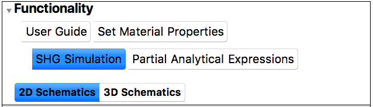

-  The `User Guide` is selected by default when the notebook is evaluated. It displays the Welcome Page and a quick example of how to use ♯SHAARP._ml_ on the output panel.

-  The `Set Material Properties` tab allows the user to describe the multilayer to be probed by specifying the materials, thicknesses, crystal structures and orientations and their optical properties (linear and non-linear susceptibilities). 

-  `SHG Simulation` shows the polarimetry settings to simulate the SHG intensities for the given multilayer. It also provides the options to display the Fresnel coefficients and Maker Fringes plot, and apply various assumptions as required. 

-  The `2D(3D) Schematics` (available only when `SHG Simulation` or `Set Material Properties` is selected) shows the multilayer in real space as an interactive 2D(3D) figure on the output panel. 

!!! note
	 Please click on any of the `Update` buttons after specifying the inputs for the changes to take place on the output panel. This includes any changes to the input parameters on any of the input sub-panels.

-  `Partial Analytical Expressions` derives the SHG reflectance and transmittance in terms of unknown layer thicknesses and SHG tensor elements provided as symbolic variables in the `Set Material Properties` tab.

### Set Material Properties

The following sub-panels are visible when the `Set Material Properties` tab is selected in the `Functionality` sub-panel. 

!!! note
	Please click on `Update` after specifying the inputs for the changes to take place. This includes any changes to the input parameters on any of the input sub panels.

#### Wavelength Setting

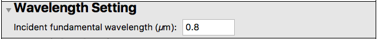

-  Enter the wavelength (in vacuum) of the fundamental light incident on the multilayer.
-  The value is to be entered in $\mu$m.

#### Layer Selection

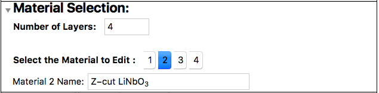

-  Number of Layers refers to the number of layers that the multilayer is made up of.
-  Each layer can be assigned a name by the user in the text box provided.
-   Select the layer number whose properties need to be modified. 

#### Case Study and Examples

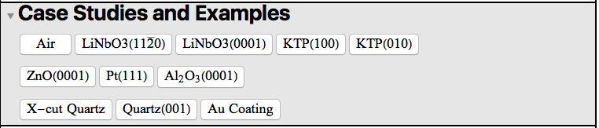

-  Crystal and optical properties of some common materials such as air, LiNbO3 (LNO), KTiOPO4 (KTP), etc. are pre-defined for convenience. The user may just click the layer number and select any of the above to quickly apply the properties to the selected layer. 
-  Click on `Blank linear` or `Blank nonlinear` to define a new linear or non-linear material with user provided crystal structure, crystal orientation, linear susceptibilities (and SHG tensors for non-linear materials).

!!! note
	Check out the presets sub-panel below to save the user defined crystal and optical properties as a preset.

#### Layer thickness

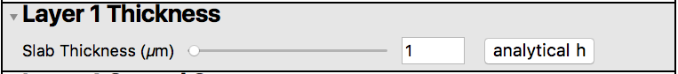

-  Set the layer thickness in $\mu$m.
-  In case of partial analytical expressions, click on `analytical h` to assign the layer `i` an unknown thickness (`hi` by default) where `i` is the layer number selected in the `Materials Selection` sub-panel.

#### Crystal Structure

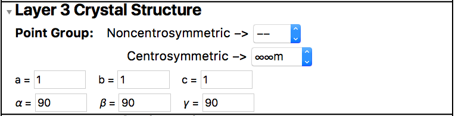

-  Select the point group of the `i`th layer from the drop-down menu.
-  Enter the crystallographic constants describing the unit cell. The lengths $a$, $b$, $c$ are to be entered in Angstroms and the bond angles $\alpha$, $\beta$, $\gamma$ in degrees. 

#### Crystal Orientation

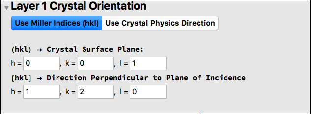

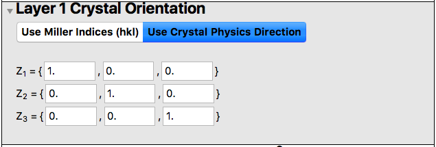

To define the crystal orientation of the selected layer, one can use either the `Miller Indices (hkl)` or the `Crystal Physics Directions`. 

-  In case of `Miller Indices (hkl)`, the first set of h-k-l values corresponds to the respective surface plane (hkl) while the next set of h-k-l defines the direction perpendicular to the plane of incidence [hkl].    

-  If using `Crystal Physics Directions`, enter the components of the vectors $Z_1$, $Z_2$, $Z_3$ in the lab coordinate system $(L_1, L_2, L_3)$. 

Click `Update` to visualize the crystal orientation of the selected layer with respect to the lab coordinate system on the output panel as a 2D/3D schematic. 

!!! note
	An error is shown if the Miller indices of the crystal surface plane is inconsistent with indices defining the normal to the plane of incidence. 

#### Dielectric tensors

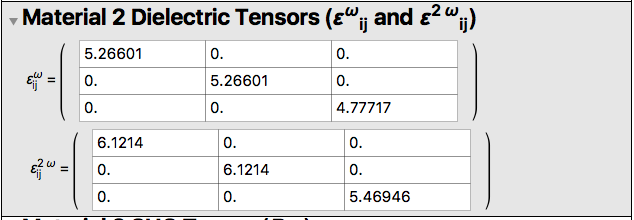

-  Enter the dimensionless dielectric tensor $\epsilon_{ij}$ (as expressed in the crystal physics coordinate system) at both, the fundamental $\omega$ and the second-harmonic $2 \omega$ frequencies.
-  Note that complex values may be entered above. _Mathematica®_ uses `I` (capital i) to denote iota, the complex second root of unity. 
-  For the materials in the `Case Study` sub-panel, the dielectric tensor at $\omega$ and $2 \omega$ frequencies are set to update with the fundamental wavelength provided by the user. **For this to work, the user needs to enter the wavelength first and then select the material from the `Case Study` sub-panel.**

#### SHG tensor

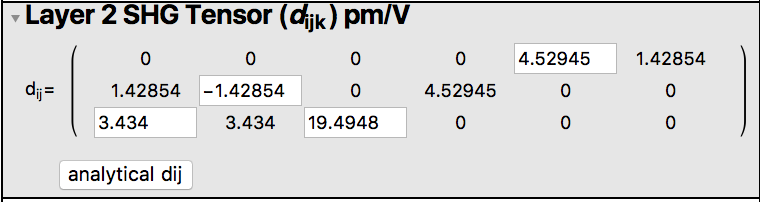

-  Enter the components of the SHG tensor $d_{ij}$ (expressed in Voigt notation) in units of pm/V​. Note that constraints due to the point group symmetry are automatically imposed on the SHG tensor. 
-  Click `analytical dij` if interested in partial analytical expressions involving unknown SHG tensor components. The components are labelled as `dijmk` by default (here, `k` refers to the layer number). The values are assumed to be in units of pm/V. 
-  In the case where certain components of the SHG tensor is known, click `analytical dij` and manually enter the known components. In this case, the partial analytical expression only involves the unknown symbolic components. 

!!! note
	Running SHG simulation with unknown SHG tensors and thicknesses causes the program to stall. In this case, quit the kernel and start over again.

#### Layer Properties Preset Values

Apart from the already provided presets in the case study sub-panel, the user may define the film thickness, crystal structure, orientation, dielectric tensors (at fundamental and second harmonic frequencies) and SHG tensors for a material of their choice and save it as a preset. 

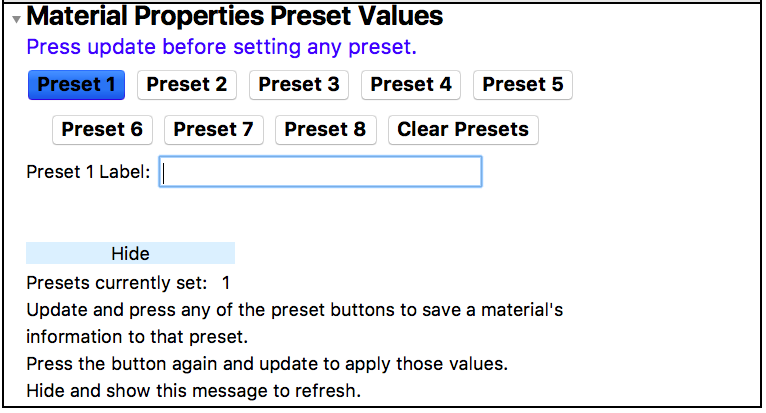

To save a preset, first enter the crystal and optical properties of the layer. Click `Update` and then select the `Preset 1` to save the values. Similarly, one needs to save the properties to the other presets. When a preset is saved, the corresponding button appears blue.

To apply the preset values, first select the layer from the material selection sub-panel and then click the `Preset i` button to apply the properties stored in the i preset to the selected layer. `Clear Presets` removes all the saved preset information.

!!! note
	Presets save only the information related to the material and does not save the experimental settings such as wavelength, polarimetry setup or the experimental geometry.

!!! note
	Presets currently do not save the information across different sessions. 

### SHG Simulation

!!! note
	Please click `Update` after providing the material inputs to save the multilayer. 

!!! note
	SHG simulation fails if symbolic expressions (for thickness and SHG tensor) are provided in the `Set Material Properties` tab.

The following sub-panels describe the required parameters for generating the polar plots, Fresnel coefficients and Maker fringes. 

#### Calculation Controls

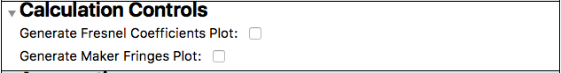

Check if a plot of Fresnel coefficients and/or Maker fringes as a function of incident angle is to be generated.

#### Assumptions

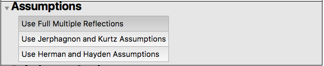

Click the respective boxes to apply full multiple reflections, Jerphagnon-Kurtz or Herman-Hayden assumptions for the calculation of the polar plots, Fresnel coefficients and/or Maker fringes. In case of full multiple reflections, further specify if backward waves need to be considered, and if so, whether to consider standing waves or not.

#### Polarimetry Settings

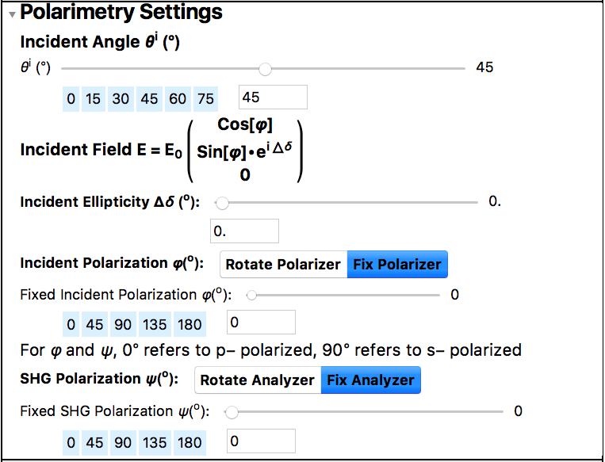

-  Incident angle $\theta^i$ specifies the angle (in degree) between the incident ray and the normal to the incident surface. The user may either manually enter a value between 0$^{\circ}$ and 90$^{\circ}$ in the box, or use the slider to set the required value. Some commonly used angles are also provided; click the respective angle to set it.
-  The incident electric field vector may be characterized by the polarization angle $\varphi$ and the ellipticity $\Delta \delta$ (both in degrees).
-  The ellipticity $\Delta \delta$ may be manually set by entering a value (in degree) between 0$^{\circ}$ and 360$^{\circ}$ in the provided box or by dragging the slider. 
-  Depending on the measurement setup, one may choose either a rotating polarizer or a fixed polarizer. In case of the latter, the polarization angle $\varphi$ (in degree) may be entered by providing a value between 0$^{\circ}$ and 360$^{\circ}$ in the box, or by dragging the slider. Some commonly used angles are also provided.
-  $\varphi=0^{\circ}$ corresponds to p polarized light while $\varphi = 90^{\circ}$ corresponds to s polarization. With respect to the lab coordinate system,  $\varphi=90^{\circ}$ points in the direction of $+L_2$.
-  Similarly, either a rotating analyzer or a fixed analyzer setting may be used depending on the optical setup. The angle, if required, is set similar to as described above. 
-  For a rotating polarizer, rotating analyzer setup, the analyzer-polarizer offset angle may be entered (in degree).

#### Fresnel coefficients collection settings 

!!! note
	This sub-panel is visible only if `Generate Fresnel Coefficients Plot` is checked in the `Calculation Controls` sub-panel.

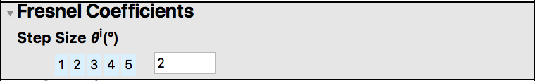

The Fresnel coefficients are calculated for incident angles $\theta^i$ from 0$^{\circ}$ to 90$^{\circ}$. The step size (in degree) determines the resolution of the calculated plot. A smaller step size produces a finer plot but takes longer time for the calculation.

#### Maker Fringes collection settings

Note: This sub-panel is visible only if `Generate Maker Fringes Plot` is checked in the `Calculation Controls` sub-panel.

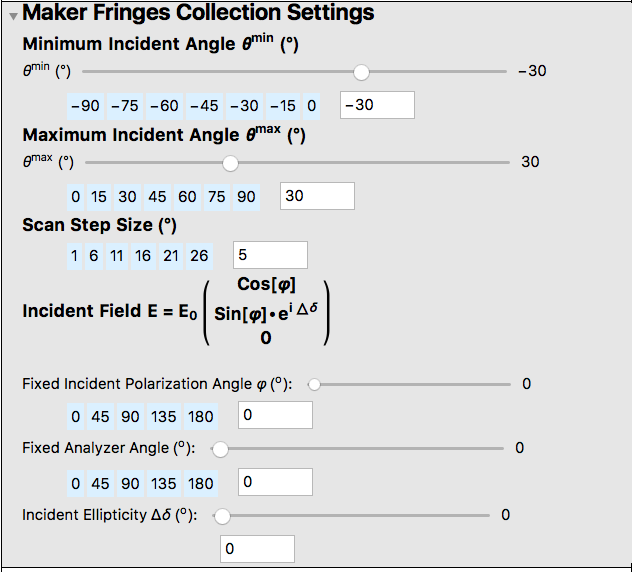

-  The Maker fringes are calculated for incident angles $\theta^i$ lying between $\theta^{min}$ and $\theta^{max}$. As described previously, provide the required values for $\theta^{min}$ and $\theta^{max}$ (in degree).
-  Set the scan step size (in degree) depending on the required accuracy.
-  As described in the `Polarimetry Settings` sub-panel above, enter the incident polarization angle, analyzer angle and the ellipticity (all in degree).

### Partial Analytical Expressions

!!! note
	Ensure that either the thickness and/or the SHG tensor elements have been set to `analytical h` and/or `analytical dij` respectively in the `Set Material Properties` section before proceeding with the calculation of the analytical expressions.

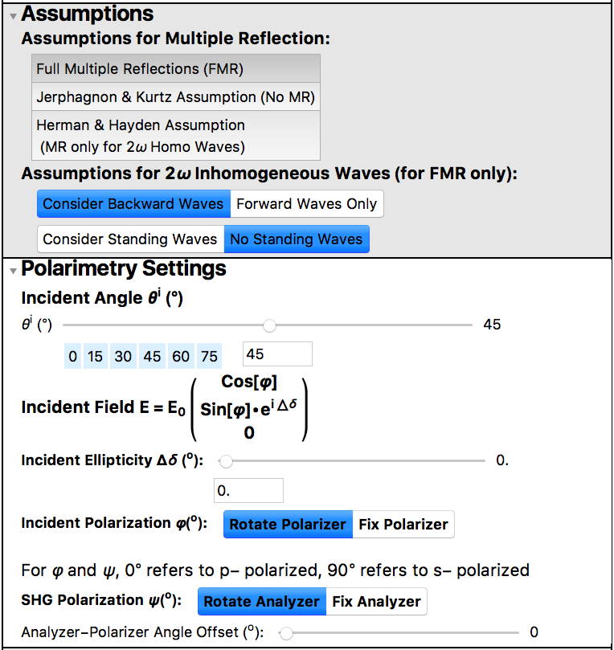

-  Select the assumptions to be applied while solving for the reflection and transmission coefficients from the `Assumptions` sub-panel.
-  In the `Polarimetry Settings` sub-panel, enter the incident angle and ellipticity in degree. Depending on the requirement, the polarizer and analyzer angles may be entered. See `Polarimetry Settings` under `SHG Simulation` for more details.

