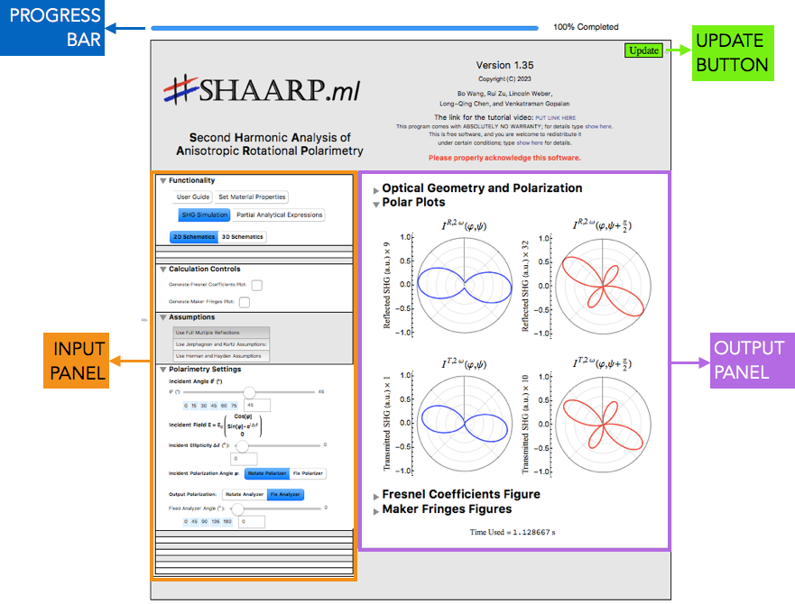

## Installation

\#SHAARP.ml is a graphical user interface embedded in a Mathematica notebook and requires either Wolfram Mathematica or Wolfram Player to use and interact with it. #SHAARP.ml can be downloaded from [[GitHub (insert link)](insert link) :question:]​ ​as a zip file or by cloning the repository. Instructions to install Mathematica (licensed) may be found [here](https://reference.wolfram.com/language/tutorial/InstallingMathematica.html). Wolfram Player is a free [download](https://www.wolfram.com/player/) and can be used to view and interact with Mathematica notebooks, but doesn't provide any editing functionalities.

Note: It is recommended to keep all the files in the same directory to access all the features provided by SHAARP.

1. Open the main notebook file [`PATH/SHAARP???.nb` :question:]​  using Mathematica or Wolfram Player.

2. Making sure that Dynamic Evaluation is enabled, evaluate the notebook by clicking `Evaluation > Evaluate` from the menu bar. This process clears the definitions from the other currently open notebooks and enables the "Notation" package required for the analytical solutions.

3. The main panel should now be visible after sometime. Please give atleast 30 seconds for the initialization process. If you face issues, please re-evaluate the notebook or restart Mathematica. 

4. 
   

   The main panel contains the following sub-panels:

   -  Input panel for providing the material properties, polarimetry settings, simplifying assumptions, etc
   -  Output panel to display the optics geometry, generated polar plots, Maker fringes, partial analytical expressions, etc.
   -  Update button to run the calculations after specifying the various input parameters
   -  Progress bar to indicate the progress of the calculation after clicking Update
