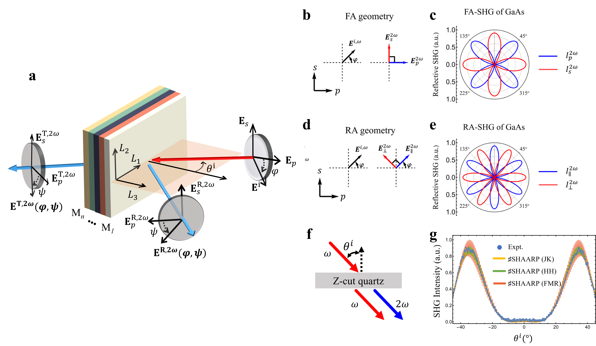
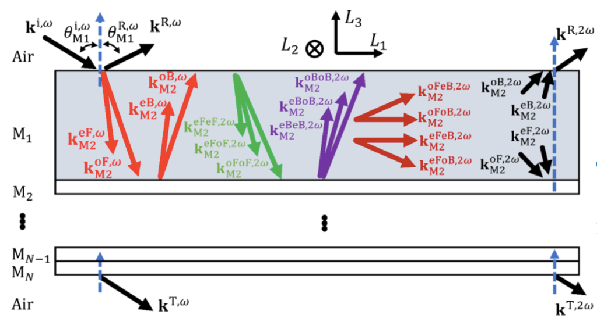
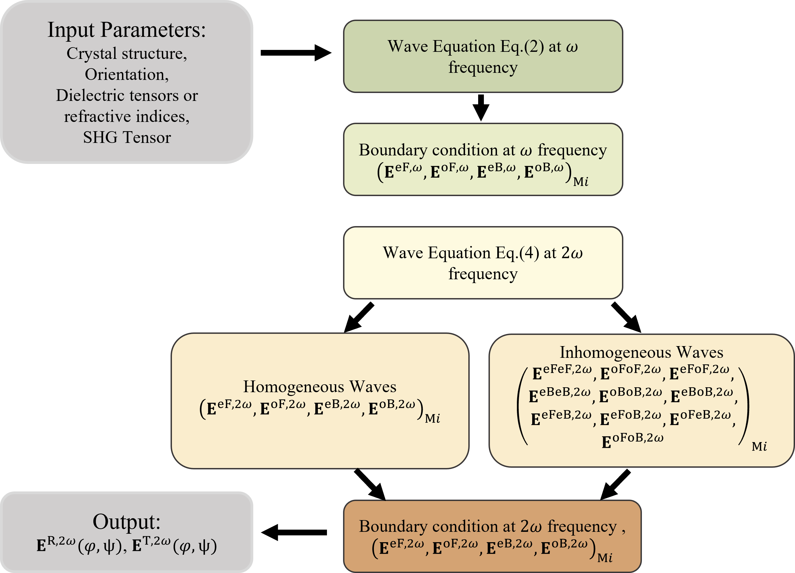

# Simulation and Analytical Methods
## Optical Geometry

**Figure. 1** summarizes common experimental nonlinear optical characterization methods. The red and blue rays in **Figure 1a** are the fundamental and second harmonic light, respectively. The plane of incidence is defined as the $L_1 - L_3$ plane, where $(L_1,L_2,L_3)$ are the lab coordinates. As shown in **Figure 1**, both transmitted or reflected SHG signals can thus be acquired from the sample, which can contain many layers that will influence the final optical response. Two commonly applied characterization methods, namely Maker fringes and SHG polarimetry, can be used for characterizing crystal structures, polar orders, second-order nonlinear optical susceptibilities, etc.

### SHG Polarimetry
While rotating the incident polarization ($E$$^i$($\phi$)), polarized SH intensities are collected as a function of the azimuthal angle. **Fig. 1b** depicts the collection of _p_ and _s_ polarized SH intensities ($I_p^{2\omega} (\varphi)$ and $I_s^{2\omega} (\varphi)$) and **Fig. 1d** illustrate the SH intensities polarized both parallel and perpendicular to the incident fundamental polarization ($I$$_\parallel$$^2$$^\omega$ ($\varphi$) and $I$$_\perp$$^2$$^\omega$ ($\varphi$)) if projected in $s - p$ plane. Here, _s_ and _p_ describes the electrical fields of electromagnetic waves within and perpendicular to the plane of incidence ($L_1 - L_3$ plane), respectively.

The former geometry is commonly achieved with a rotating halfwave plate and fixed analyzer, while the latter geometry can be achieved by simply rotating the crystal or rotating the halfwave plate and analyzer simultaneously. **Fig. 1c** and **e** demonstrate the SHG polar plots of GaAs (111) obtained at normal incident geometry which contain information of crystal symmetry, refractive indices at both $\omega$ and $2\omega$ frequencies, and second-order nonlinear susceptibility.

### Maker fringes
The other standard method is called Maker fringes which was developed by Maker, et al. in 1961.1 Instead of making polarization states of light as variables, Maker fringes method fixes polarization states of light and record transmitted SHG intensities as a function of incident angles, as shown in **Figure 1f** and **1g**. The Maker fringes method is sensitive to crystal thickness, refractive indices and can be used to extract ratio among nonlinear susceptibilities. However, unlike SHG polarimetry that can be obtained using both transmission and reflection, the Maker fringes method is constrained in the transmission geometry.

	**Figure 1. Summary of experimental SHG setup and common characterization methods, including SHG polarimetry and Maker fringes.** **a** Experimental setup for reflective and transmissive SHG measurement of a heterostructure. Red and blue waves suggest a pump beam at $\omega$ and signal beam at $2\omega$ frequency, separately. $(L_1,L_2,L_3)$ is the lab coordinate system. The orange and dark gray planes are the sample surface and plane of incidence ($L_1 - L_3$ plane).  $\varphi$ is the azimuthal angle. **b-c** _p_- and _s_- polarized SHG intensities as a function of incident fundamental polarization. **d-e** SHG intensities polarized both parallel and perpendicular to the incident polarization projected in $s - p$ plane.  **b,e** Relations of incident polarization and SHG polarization projected in $s - p$ plane. **c,f** SHG polar plots of GaAs (111) in the normal incident geometries using two experimental configurations described in panels **b** and **d**, respectively. **f**,**g** describes Maker fringes method and resulting Maker fringes pattern using 300 $\mu$m X-cut quartz. JK, HH and FRM refer to Jerphagnon & Kurtz's method2, Herman and Hayden's method3 and full multiple reflection.

## Coordinate System

Four different coordinate systems shown in **Fig. 2** are involved in fully describing the SHG measurement, and it is essential to establish their absolute and relative orientations.

On the lab scale, $(L_1,L_2,L_3)$ describe the _lab coordinate system_ (LCS) and $L_3$ corresponds to the normal to the surface; this coordinate system is always orthogonal. 

Looking at the atomic scale, the translation vectors of a unit cell of the crystal determine the _crystallographic coordinate system_ (CCS) given by (_a_, _b_, _c_); these axes need _not_ be orthogonal.

The $(Z_1,Z_2,Z_3)$ represent the _crystal_ _physics coordinate system_ (ZCS) in which the material property tensors are represented; they are always orthogonal and their orientation relative to (_a_, _b_, _c_) follows Newnham’s convention.

The $(Z_1^{Principal},Z_2^{Principal},Z_3^{Principal})$ is the _principal coordinate system_ (PCS), where dielectric tensors or refractive index tensors are diagonalized; this coordinate system is also always orthogonal. For an isotropic or uniaxial structure, $(Z_1,Z_2,Z_3)\equiv (Z_1^{Principal},Z_2^{Principal},Z_3^{Principal})$, which simplifies the overall problem. However, for a biaxial crystal, the PCS is _defined_ with the real part of the refractive indices along each axis following the ascending order, i.e.,$n(Z_1^{Principal})<n(Z_2^{Principal})<n(Z_3^{Principal})$ , while this is _not_ generally true in the crystal physics coordinate system. Henceforth, we will adopt the notation $n(Z_1^{Principal}) \equiv n_i^{\omega}$ for the Eigen values for the refractive index. In the PCS, the diagonal components of the complex _relative_ dielectric function can be conveniently written as $\tilde\varepsilon =\varepsilon_0 \tilde{n}^2$, where $\varepsilon_0$ is the vacuum permittivity. Therefore, the dielectric permittivity $\varepsilon_i^{\omega}$ in the LCS can be expressed as

$$
\varepsilon_i^{\omega} = a_{LZ}a_{ZP}\begin{pmatrix} n_1^{\omega}&0&0 \\\ 0&n_2^{\omega}&0 \\\ 0&0&n_3^{\omega}\end{pmatrix}^2(a_{LZ}a_{ZP})^{-1}\hspace{3em}(1)
$$

where $a_{LZ}$ is the rotation matrix from ZCS to the LCS and $a_{ZP}$ is the rotation matrix from the PCS to the ZCS, respectively.

>**Figure 2. Schematic of four coordinate systems used for a monoclinic structure.** $(L_1,L_2,L_3)$, $(a,b,c)$, $(Z_1,Z_2,Z_3)$, and $(Z_1^{Principal},Z_2^{Principal},Z_3^{Principal})$ are the lab, crystallographic, crystal physics, and principal coordinate systems, respectively. Only the crystallographic coordinate system is non-orthogonal.

## Waves in Nonlinear Medium

### Single Interface
When a monochromatic plane wave at frequency $\omega$ is incident upon the interface, two refracted rays at frequency $\omega$ will propagate inside the medium with two orthogonal dielectric displacement vectors $\pmb{D}^{T,e,\omega}$ and $\pmb{D}^{T,o,\omega}$. The two waves can be both ordinary, or one ordinary and one extraordinary, depending on the optical class of the material and the propagation direction. Without loss of generality, we denote the two refracted waves by superscripts _T_, as shown in green in **Fig. 3**. The two fundamental waves correspond to the Eigen solutions of the wave equation at the linear frequency, $\omega$, given in the LCS as

$$
\begin{align}
\nabla\times\nabla\times \pmb{E}^{T,\omega}
\begin{pmatrix} \varepsilon_{L_1L_1}^{\omega}&\varepsilon_{L_1L_2}^{\omega}&\varepsilon_{L_1L_3}^{\omega} \\\ \varepsilon_{L_2L_1}^{\omega}&\varepsilon_{L_2L_2}^{\omega}&\varepsilon_{L_2L_3}^{\omega} \\\ \varepsilon_{L_3L_1}^{\omega}&\varepsilon_{L_3L_2}^{\omega}&\varepsilon_{L_3L_3}^{\omega}
\end{pmatrix}
\mu^{\omega}
\frac{\partial^2}{\partial t^2}
\pmb{E}^{T,\omega}=0\hspace{3em}(2)
\end{align}
$$

where $\varepsilon_{L_iL_j}^{\omega}$ represents the dielectric permittivity tensor at frequency $\omega$ in the LCS, and the $\mu^{\omega}$ represents the magnetic permeability in the LCS at $\omega$. Typically, $\mu^{\omega}\approx\mu_0$, the vacuum permittivity is assumed. In general, the anisotropic dielectric permittivity and magnetic permeability tensors of the medium are not diagonalized in the lab coordinates (LCS). Therefore, the non-collinearity between $\pmb{E}$ and $\pmb{D}$, as well as $\pmb{B}$ and $\pmb{H}$ results in two non-overlapping orthogonal relations ($\pmb{k}$, $\pmb{D}$, $\pmb{B}$) and ($\pmb{S}$, $\pmb{E}$, $\pmb{H}$). Here, $\pmb{k}$, $\pmb{D}$, $\pmb{B}$, $\pmb{S}$, $\pmb{E}$, and $\pmb{H}$ are wavevector, dielectric displacement, magnetic induction, Poynting vector, electric field and magnetic field intensity. Note that $\pmb{E}$ and $\pmb{H}$ are not necessarily normal to the wavevector $\pmb{k}$ inside the medium.

>**Figure 3. Schematic example of different waves at both $\omega$ and $2\omega$ frequencies for the specific measurement geometry where the optic axis of an uniaxial crystal is chosen to lie in the incidence plane.** (Note that ♯SHAARP can in general handle an arbitrary orientation of the optic axes with respect to the incidence plane).  The green and blue rays are homogeneous waves at $\omega$ and $2\omega$ frequency. The red ray are the inhomogeneous waves at $2\omega$.

The second-order nonlinear susceptibility induces a nonlinear polarization and thus radiates nonlinear source waves at $2\omega$ frequency. The source wave at $2\omega$ frequency can be written as,

$$
\begin{align}
\pmb{P}^{2\omega}=\varepsilon_0\chi^{(2)}\pmb{E}^{T,\omega}\pmb{E}^{T,\omega}e^{i(\pmb{k}^S⋅\pmb{r}-\omega t)}\hspace{3em}(3)
\end{align} 
$$

where $\pmb{P}^{2\omega}$, $\pmb{E}^{T,\omega}$, $\chi^{(2)}$ are the nonlinear polarization, the electric field of the refracted $\omega$ waves, and the second-order nonlinear susceptibility. The term $\pmb{k}^S$ is the wavevector of the source wave (superscript _S_) that combines two linear wavevectors, i.e., $\pmb{k}^S=2\pmb{k}^{T,\omega}$. The electric fields radiated by the nonlinear polarization can then be calculated in the LCS using the wave equation,

$$
\begin{align}
\nabla\times\nabla\times \pmb{E}^{T,2\omega}+
\begin{pmatrix} \varepsilon_{L_1L_1}^{2\omega}&\varepsilon_{L_1L_2}^{2\omega}&\varepsilon_{L_1L_3}^{2\omega} \\\ \varepsilon_{L_2L_1}^{2\omega}&\varepsilon_{L_2L_2}^{2\omega}&\varepsilon_{L_2L_3}^{2\omega} \\\ \varepsilon_{L_3L_1}^{2\omega}&\varepsilon_{L_3L_2}^{2\omega}&\varepsilon_{L_3L_3}^{2\omega}
\end{pmatrix}
\mu^{2\omega}
\frac{\partial^2}{\partial t^2}
E^{T,2\omega}=-\mu^{2\omega}\frac{\partial^2}{\partial t^2}\pmb{P}^{2\omega}\hspace{3em}(4)
\end{align} 
$$

where $\varepsilon_{L_i L_j}^{2\omega}$ represents the dielectric permittivity tensor at frequency $2\omega$ in the LCS, and the $\mu^{2\omega}$ represents the magnetic permeability in the LCS at $2\omega$. The homogeneous wave and inhomogeneous waves radiated by the nonlinear polarization correspond to the general and particular solutions of **Equation 4**, respectively. The former component is also known as the “free wave”, and the latter is the radiated wave by the nonlinear polarization known as the “bound wave.” The total nonlinear wave can be expressed as a superposition of the general and particular solutions. To solve the homogeneous wave at both linear (**Equation 2**) and nonlinear (**Equation 4**) frequencies, the _congruence transformation,_ and _generalized Eigen equation_ are employed. The two eigenvalues and eigenvectors correspond to effective refractive indices and electric field directions for the two homogeneous _e_ and _o_ waves at the corresponding frequencies. Three inhomogeneous waves $(\pmb{k}^{T,ee,2\omega},\pmb{k}^{T,oo,2\omega},\pmb{k}^{T,eo,2\omega})=(2\pmb{k}^{T,e,\omega},2\pmb{k}^{T,o,\omega},\pmb{k}^{T,e,\omega}+\pmb{k}^{T,o,\omega})$, will be generated according to **Equation 3**, as shown in **Fig. 3**, due to the three-wave mixing process. Therefore, in principle, five waves at $2\omega$ will be generated, as shown in **Fig. 3**, where blue and red correspond to homogeneous and inhomogeneous waves, respectively. The inhomogeneous SHG fields can be written in the following form:

$$
\begin{align}
\pmb{E}^{T,ee,2\omega}=\pmb{C}^{T,ee,2\omega}e^{i(\pmb{k}^{T,ee,2\omega}⋅\pmb{r}-\omega t)}\hspace{4em}
\end{align}
$$

$$
\begin{align}
\pmb{E}^{T,oo,2\omega}=\pmb{C}^{T,oo,2\omega}e^{i(\pmb{k}^{T,oo,2\omega}⋅\pmb{r}-\omega t)}\hspace{4em}
\end{align} 
$$

$$
\begin{align}
\pmb{E}^{T,eo,2\omega}=\pmb{C}^{T,eo,2\omega}e^{i(\pmb{k}^{T,eo,2\omega}⋅\pmb{r}-\omega t)}\hspace{3em}(5)
\end{align}
$$

where **C** is the field strength to be determined from **Equation 4** for a given $\pmb{P}^{2\omega}$. By substituting **Equation 3** and **5** into **Equation 4**, the field strengths of the three inhomogeneous waves can be explicitly calculated with the associated second-order optical susceptibilities. Accordingly, the $\pmb{H}^{2\omega}$ for the three inhomogeneous waves can be obtained by

$$
\begin{align}
\pmb{H}^{2\omega}=\frac{1}{\omega\mu_0}\mu^{-1}\pmb{k}^{2\omega}\times \pmb{E}^{2\omega}\hspace{3em}(6)
\end{align}
$$

### Multilayer with Multiple Reflections

The optical dipolar second harmonic generation in a multilayer, is defined by the generation of nonlinear polarization at $2\omega$ frequency when the NLO materials are pumped under the incident electric fields at $\omega$ frequency, defined as

$$
\begin{align}
\pmb{P}_{Mi}^{2\omega}=\varepsilon_0\chi^{(2)}\pmb{E}_{Mi}^{\omega}\pmb{E}_{Mi}^{\omega}e^{i(\pmb{k}^S⋅\pmb{r}-2\omega t)}\hspace{3em}(7)
\end{align} 
$$

where $\pmb{P}_{Mi}^{2\omega}$, $\pmb{E}_{Mi}^{\omega}$, $\varepsilon_0$, $\chi^{(2)}$, $\pmb{k}^S⋅$ and $\pmb{r}$ are nonlinear polarization, fundamental electric field, vacuum dielectric permittivity, second-order nonlinear optical susceptibility, wave vector of the source wave, and displacement vector, respectively. Since arbitrary layers can be SHG active, thus $\pmb{P}_{Mi}^{2\omega}$ will appear when the $i^{th}$ layer is SHG active, as denoted by the subscript Mi. It is important to note that during the propagation of fundamental fields, the nonlinear polarization is generated throughout the entire optical path of $\pmb{E}_{Mi}^{\omega}$, according to **Equation 7**. When the multiple reflections of nonlinear polarization are considered, the interference of nonlinear polarization can thus be obtained by considering the multiple reflections of $\pmb{E}_{Mi}^{\omega}$.

>**Figure 4. Ray diagram of SHG in a heterostructure.** The ray diagram of birefringent linear and nonlinear waves in the heterostructure. The M1 layer is set to be SHG active while others remain SHG inactive for more explicit demonstration. Both $\pmb{k}^{eFeB,2\omega}$ and $\pmb{k}^{oFoB,2\omega}$ are propagating parallel to layers. Different colors are used to distinguish different waves and are not indicative of their frequencies. ($L_{1},L_{2},L_{3}$) is the lab coordinate system. Red and blue rays are the fundamental beam at $\omega$ and SHG waves at $2\omega$, respectively. $\theta_{M1}^{i,\omega}$ is the incident angle, and the plane of incidence(PoI) is indicated by the $L_{1}-L_{3}$ plane. The layers are subsequently labeled from M1 to MN.

Unlike single interface model where only forward propagatssing waves are involved, both forward and backward propagating waves are included for multilayer. Fully accounting all waves will take multiple reflections into account. The anisotropic three-wave mixing phenomena is revealed in **Equation 7**, where material anisotropy is taken into account. In each SHG active medium (M*i*), the forward and backward nonlinear polarizations can thus be identified as $\pmb{k}^{S,2\omega}=2\pmb{k}^{eF,\omega}$, $2\pmb{k}^{oF,\omega}$, $\pmb{k}^{eF,\omega}+\pmb{k}^{oF,\omega}$, $2\pmb{k}^{eB,\omega}$, $2\pmb{k}^{oB,\omega}$, $\pmb{k}^{eB,\omega}+\pmb{k}^{oB,\omega}$, $\pmb{k}^{eF,\omega}+\pmb{k}^{eB,\omega}$, $\pmb{k}^{eF,\omega}+\pmb{k}^{oB,\omega}$, $\pmb{k}^{oF,\omega}+\pmb{k}^{eB,\omega}$, and $\pmb{k}^{oF,\omega}+\pmb{k}^{oB,\omega}$. The wavevectors for the ten nonlinear polarizations in the $i^{th}$ layer are thus denoted as ($\pmb{k}^{eFeF,2\omega}$, $\pmb{k}^{oFoF,2\omega}$, $\pmb{k}^{eFoF,2\omega}$, $\pmb{k}^{eBeB,2\omega}$, $\pmb{k}^{oBoB,2\omega}$, $\pmb{k}^{eBoB,2\omega}$, $\pmb{k}^{eFeB,2\omega}$, $\pmb{k}^{eFoB,2\omega}$, $\pmb{k}^{oFeB,2\omega}$, $\pmb{k}^{oFoB,2\omega}$$)_{Mi}$ for clarity, as shown in **Figure 4**. The superscripts e, o, F and B are used to describe the different combinations of electric fields forming nonlinear polarizations, where e, o, F and B stand for extraordinary, ordinary, forward propagating and backward propagating waves. For example, a nonlinear polarization ($\pmb{P}^{eFoB,2\omega}$) is formed when a forward propagating extraordinary wave ($\pmb{k}^{eF,\omega}$) and a backward propagating ordinary wave ($\pmb{k}^{oB,\omega}$) are combined. However, the wave mixing terms containing both forward and backward waves are often dropped or ignored, such as $\pmb{k}^{eFeB,2\omega}$ and $\pmb{k}^{oFoB,2\omega}$ due to a large phase mismatch. lthough these terms form standing waves propagating parallel to the layers, the formed standing waves at both the top and bottom surfaces of each layer still contribute to the boundary conditions. For example, a nonlinear polarization ($\pmb{P}^{eFeB,2\omega}$) can be generated by a mixture of $\pmb{k}^{eF,\omega}$ and $\pmb{k}^{eB,\omega}$ at top or bottom surfaces leading to additional components in the boundary conditions.

The particular solutions of **Equation 4** can thus be obtained. The corresponding electric field of the nonlinear polarization adopts the form as $\pmb{E}^{eFeF,2\omega}=\pmb{C}^{eFeF,2\omega}e^{i(\pmb{k}^{eFeF,2\omega}·\pmb{r}-2\omega t)}$, taking the mixture of two forward extraordinary waves as an example. Here, $\pmb{C}^{eFeF,2\omega}$ is a vector describing the direction and magnitude of the resulting bounded electric field due to the nonlinear polarization. Thus, all electric and magnetic fields generated by ten distinct nonlinear polarizations can be uniquely identified by solving **Equation 4**. On the other hand, the general solutions, known as the homogeneous waves, can be calculated following the same procedure as solving **Equation 1** but at $2\omega$ frequency. Four nonlinear waves will be obtained to fully describe the multiple reflections of homogeneous waves, namely, $(\pmb{E}^{eF,2\omega},\pmb{E}^{oF,2\omega},\pmb{E}^{eB,2\omega},\pmb{E}^{oB,2\omega})_{Mi}$, whose field strengths are determined using boundary conditions.

## Boundary Conditions

### Single Interface
Boundary conditions are important to accurately determine the propagation directions and the field strengths of waves. To satisfy the momentum conservation at both $\omega$ and $2\omega$ frequencies, it is required that

$$
\begin{align}
k^{i,\omega}_{L_1}=k^{R,\omega}_{L_1}=k^{T,e,\omega}_{L_1}=k^{T,o,\omega}_{L_1}\hspace{3em}(8)
\end{align}
$$

$$
\begin{align}
k^{R,2\omega}_{L_1}=k^{S,2\omega}_{L_1}=k^{T,e,2\omega}_{L_1}=k^{T,o,2\omega}_{L_1}\hspace{3em}(9)
\end{align}
$$

from which the wavevectors and propagation angles of all refractive and reflective waves can be determined. The continuity across the interface of the components, $E_{\parallel}$ and $H_{\parallel}$, of the electric and magnetic fields parallel to the interface, respectively, also yields the boundary conditions for the $2\omega$ waves, given by

$$
\begin{align}
E^{R,2\omega}_{\parallel}=E^{T,e,2\omega}_{\parallel}+E^{T,o,2\omega}_{\parallel}+E^{T,ee,2\omega}_{\parallel}+E^{T,oo,2\omega}_{\parallel}+E^{T,eo,2\omega}_{\parallel}=E^{T,2\omega}_{\parallel}\hspace{3em}(10)
\end{align}
$$

$$
\begin{align}
H^{R,2\omega}_{\parallel}=H^{T,e,2\omega}_{\parallel}+H^{T,o,2\omega}_{\parallel}+H^{T,ee,2\omega}_{\parallel}+H^{T,oo,2\omega}_{\parallel}+H^{T,eo,2\omega}_{\parallel}=H^{T,2\omega}_{\parallel}\hspace{3em}(11)
\end{align}
$$

where superscripts $e$ and $o$ represent homogeneous waves at $2\omega$ and $ee$, $oo$ and $eo$ are inhomogeneous waves at $2\omega$ due to wave mixing. Using **Equation 8** - **11**, $E^{R,2\omega}$ and $E^{T,2\omega}$ can be calculated.

### Multilayer with Multiple Reflections

The boundary conditions for multilayer are similar to the single interface but will involve more equations to account for all the interfaces. The required momentum conservation and continuity of specific field components thus lead to the following boundary conditions at $2\omega$:

$$
\begin{align}
k^{R,2\omega}_{L_{1}}=(E^{eF,2\omega}_{L_{1}})_{Mi}=(k^{oF,2\omega}_{L_{1}})_{Mi}=(k^{eB,2\omega}_{L_{1}})_{Mi}=(k^{oB,2\omega}_{L_{1}})_{Mi}=k^{T,2\omega}_{L_{1}}, 1 \leq i \leq N \hspace{3em}(12)
\end{align}
$$

$$
\small
\begin{align}
E^{R,2\omega}_{\parallel}=
(&E^{eF,2\omega}_{\parallel}+E^{oF,2\omega}_{\parallel} 
+E^{eB,2\omega}_{\parallel}+E^{oB,2\omega}_{\parallel}+E^{eFeF,2\omega}_{\parallel}+E^{oFoF,2\omega}_{\parallel}+E^{eFoF,2\omega}_{\parallel}+E^{eBeB,2\omega}_{\parallel}
\\+&E^{oBoB,2\omega}_{\parallel}+E^{eBoB,2\omega}_{\parallel}+E^{eFeB,2\omega}_{\parallel}+E^{eFoB,2\omega}_{\parallel}+E^{oFeB,2\omega}_{\parallel}+E^{oFoB,2\omega}_{\parallel})_{M1}\hspace{5em}(13)
\end{align}
$$

$$
\small
\begin{align}
(&E^{eF,2\omega}_{\parallel}e^{i\phi^{eF,2\omega}}+E^{oF,2\omega}_{\parallel}e^{i\phi^{oF,2\omega}}+E^{eB,2\omega}_{\parallel}e^{-i\phi^{eB,2\omega}}+E^{oB,2\omega}_{\parallel}e^{-i\phi^{oB,2\omega}}+E^{eFeF,2\omega}_{\parallel}e^{i(2\phi^{eF,\omega})}
\\+&E^{oFoF,2\omega}_{\parallel}e^{i(2\phi^{oF,\omega})}+E^{eFoF,\omega}_{\parallel}e^{i(\phi^{eF,\omega}+\phi^{oF,\omega})}+E^{eBeB,\omega}_{\parallel}e^{-i(2\phi^{eB,\omega})}+E^{oBoB,2\omega}_{\parallel}e^{-i(2\phi^{oB,\omega})}
\\+&E^{eBoB,2\omega}_{\parallel}e^{-i(\phi^{eB,\omega}+\phi^{oB,\omega})}+E^{eFeB,2\omega}_{\parallel}+E^{eFoB,2\omega}_{\parallel}e^{i(\phi^{eF,\omega}-\phi^{oB,\omega})}+E^{oFeB,2\omega}_{\parallel}e^{i(\phi^{oF,\omega}-\phi^{eB,\omega})}
\\+&E^{oFoB,2\omega}_{\parallel})_{Mi}=(E^{eF,2\omega}_{\parallel}+E^{oF,2\omega}_{\parallel}+E^{eB,2\omega}_{\parallel}+E^{oB,2\omega}_{\parallel}+E^{eFeF,2\omega}_{\parallel}+E^{oFoF,2\omega}_{\parallel}+E^{eFoF,2\omega}_{\parallel}
\\+&E^{eBeB,2\omega}_{\parallel}+E^{oBoB,2\omega}_{\parallel}+E^{eBoB,2\omega}_{\parallel}+E^{eFeB,2\omega}_{\parallel}+E^{eFoB,2\omega}_{\parallel}+E^{oFeB,2\omega}_{\parallel}+E^{oFoB,2\omega}_{\parallel})_{Mi+1},1 \leq i \leq N-1 \hspace{0.5em}(14)
\end{align}
$$

$$
\small
\begin{align}
(&E^{eF,2\omega}_{\parallel}+E^{oF,2\omega}_{\parallel}+E^{eB,2\omega}_{\parallel}+E^{oB,2\omega}_{\parallel}+E^{eFeF,2\omega}_{\parallel}+E^{oFoF,2\omega}_{\parallel}+E^{eFoF,2\omega}_{\parallel}+E^{eBeB,2\omega}_{\parallel}
\\+&E^{oBoB,2\omega}_{\parallel}+E^{eBoB,2\omega}_{\parallel}+E^{eFeB,2\omega}_{\parallel}+E^{eFoB,2\omega}_{\parallel}+E^{oFeB,2\omega}_{\parallel}+E^{oFoB,2\omega}_{\parallel})_{MN}=E^{T,2\omega}_{\parallel}\hspace{5em}(15)
\end{align}
$$

$$
\small
\begin{align}
&H^{R,2\omega}_{\parallel}=(H^{eF,2\omega}_{\parallel}+H^{oF,2\omega}_{\parallel}+H^{eB,2\omega}_{\parallel}+H^{oB,2\omega}_{\parallel}+H^{eFeF,2\omega}_{\parallel}+H^{oFoF,2\omega}_{\parallel}+H^{eFoF,2\omega}_{\parallel}
\\+&H^{eBeB,2\omega}_{\parallel}+H^{oBoB,2\omega}_{\parallel}+H^{eBoB,2\omega}_{\parallel}+H^{eFeB,2\omega}_{\parallel}+H^{eFoB,2\omega}_{\parallel}+H^{oFeB,2\omega}_{\parallel}+H^{oFoB,2\omega}_{\parallel})_{M1}\hspace{3em}(16)
\end{align}
$$

$$
\small
\begin{align}
(&H^{eF,2\omega}_{\parallel}e^{i\phi^{eF,2\omega}}+H^{oF,2\omega}_{\parallel}e^{i\phi^{oF,2\omega}}+H^{eB,2\omega}_{\parallel}e^{-i\phi^{eB,2\omega}}+H^{oB,2\omega}_{\parallel}e^{-i\phi^{oB,2\omega}}+H^{eFeF,2\omega}_{\parallel}e^{i(2\phi^{eF,\omega})}
\\+&H^{oFoF,2\omega}_{\parallel}e^{i(2\phi^{oF,\omega})}+H^{eFoF,\omega}_{\parallel}e^{i(\phi^{eF,\omega}+\phi^{oF,\omega})}+H^{eBeB,\omega}_{\parallel}e^{-i(2\phi^{eB,\omega})}+H^{oBoB,2\omega}_{\parallel}e^{-i(2\phi^{oB,\omega})}
\\+&H^{eBoB,2\omega}_{\parallel}e^{-i(\phi^{eB,\omega}+\phi^{oB,\omega})}+H^{eFeB,2\omega}_{\parallel}+H^{eFoB,2\omega}_{\parallel}e^{i(\phi^{eF,\omega}-\phi^{oB,\omega})}+H^{oFeB,2\omega}_{\parallel}e^{i(\phi^{oF,\omega}-\phi^{eB,\omega})}
\\+&H^{oFoB,2\omega}_{\parallel})_{Mi}=(H^{eF,2\omega}_{\parallel}+H^{oF,2\omega}_{\parallel}+H^{eB,2\omega}_{\parallel}+H^{oB,2\omega}_{\parallel}+H^{eFeF,2\omega}_{\parallel}+H^{oFoF,2\omega}_{\parallel}+H^{eFoF,2\omega}_{\parallel}
\\+&H^{eBeB,2\omega}_{\parallel}+H^{oBoB,2\omega}_{\parallel}+H^{eBoB,2\omega}_{\parallel}+H^{eFeB,2\omega}_{\parallel}+H^{eFoB,2\omega}_{\parallel}+H^{oFeB,2\omega}_{\parallel}+H^{oFoB,2\omega}_{\parallel})_{Mi+1},1 \leq i \leq N-1 \hspace{0.5em}(17)
\end{align}
$$

$$
\small
\begin{align}
(&H^{eF,2\omega}_{\parallel}+H^{oF,2\omega}_{\parallel}+H^{eB,2\omega}_{\parallel}+H^{oB,2\omega}_{\parallel}+H^{eFeF,2\omega}_{\parallel}+H^{oFoF,2\omega}_{\parallel}+H^{eFoF,2\omega}_{\parallel}+H^{eBeB,2\omega}_{\parallel}
\\+&H^{oBoB,2\omega}_{\parallel}+H^{eBoB,2\omega}_{\parallel}+H^{eFeB,2\omega}_{\parallel}+H^{eFoB,2\omega}_{\parallel}+H^{oFeB,2\omega}_{\parallel}+H^{oFoB,2\omega}_{\parallel})_{MN}=H^{T,2\omega}_{\parallel}\hspace{5em}(18)
\end{align}
$$

where $\phi$ is the phase difference for a forward wave propagating from top to bottom surface and for a backward wave propagating from bottom to top surface in $Mi$, defined as $\phi=h_{Mi}\pmb{k}·(0,0,-1)$. **Equation 12 - 18** describe the most general case where all layers are SHG active, except for air. However, for a non-SHG active layer, all the fields of the inhomogeneous waves will be zero due to the absence of nonlinear polarization. For a standing wave formed at either the top or bottom surface in the medium $Mi$, taking $E^{eFeB,2\omega}_{\parallel}$ as an example, the phase terms are mutually canceled out, leading to the same field strength at both the interfaces. Finally, with all the nonlinear waves and boundary conditions considered, both polarization-resolved reflected and transmitted SHG intensities will be obtained in both simulation and analytical analysis.

## Outline of ♯SHAARP

### Single Interface
A flowchart illustrating the procedure for solving the equations and boundary conditions for the $\omega$ and $2\omega$ waves mentioned above is presented in **Figure 5.** The two refracted linear waves are described by solving **Equation 2**. Their actual field strengths can be obtained by using the boundary conditions at the fundamental frequency, $\omega$. Given **Eqs. 3** and **4**, two homogeneous waves and three inhomogeneous waves at $2\omega$ can be uniquely determined. Following the boundary condition analysis at $2\omega$, an analytical equation for the second harmonic response can be derived and used for polar plots simulations as well as for fitting experimental polar plots and extracting intrinsic SHG susceptibilities.

>
>**Figure 5. Flowchart illustrating the key steps in deriving the polarized second harmonic fields generated by a nonlinear medium.**

### Multilayer with Multiple Reflections

**Figure 6** illustrates the calculation procedure of ♯SHAARP._ml_. With a given point group symmetry, dielectric tensor in the ZCS, and its orientation relative to the LCS coordinate system, ♯SHAARP._ml_ will then automatically determine the mutual relations among the four coordinates systems to map out the directions of the optical axes, anisotropic wavevectors, and the ordinary and the extraordinary waves. Solving the wave equation and the boundary conditions at $\omega$ frequencies yield anisotropic forward and backward propagating waves in each layer, $(\pmb{E}^{eF,\omega},\pmb{E}^{oF,\omega},\pmb{E}^{eB,\omega},\pmb{E}^{oB,\omega})_{Mi}$. The obtained sets of field strengths are the result of multiple reflections at the pump frequency. The generated nonlinear polarizations can thus be obtained using electric fields at  frequency and are the result of multiple reflections of the source waves. Further solving the wave equation at the nonlinear frequency can thus provide forward and backward homogeneous and inhomogeneous waves in the nonlinear mediums (14 waves in each NLO layer, 4 waves in the non-NLO layer). Finally, bringing all the waves together and carrying out boundary conditions at $2\omega$ frequency will provide both transmitted and reflected polarization-resolved nonlinear optical response.
>
>**Figure 6. Calculation procedure of ♯SHAARP._ml_.** It considers the input calculation parameters regarding crystal information as well as optical properties, and generates the polarization-resolved nonlinear optical response. In semi-analytical expressions, the SHG tensor will be treated analytically, and the input of the SHG tensor is thus not required.

## Reference
1. Maker, P. D., Terhune, R. W., Nisenoff, M. & Savage, C. M. Effects of Dispersion and Focusing on the Production of Optical Harmonics. _Phys. Rev. Lett._ **8,** 21–22 (1962).
2. Jerphagnon, J. & Kurtz, S. K. Maker Fringes: A Detailed Comparison of Theory and Experiment for Isotropic and Uniaxial Crystals. _Journal of Applied Physics_ **41,** 1667–1681 (1970).
3. Herman, W. N. & Hayden, L. M. Maker fringes revisited: second-harmonic generation from birefringent or absorbing materials. _J. Opt. Soc. Am. B, JOSAB_ **12,** 416–427 (1995).