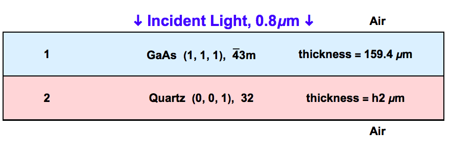
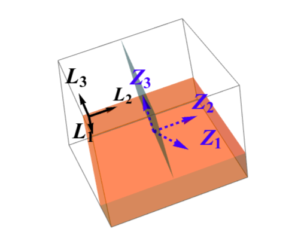
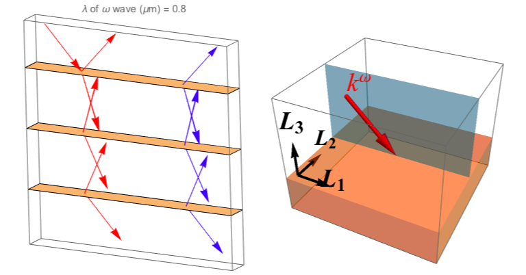
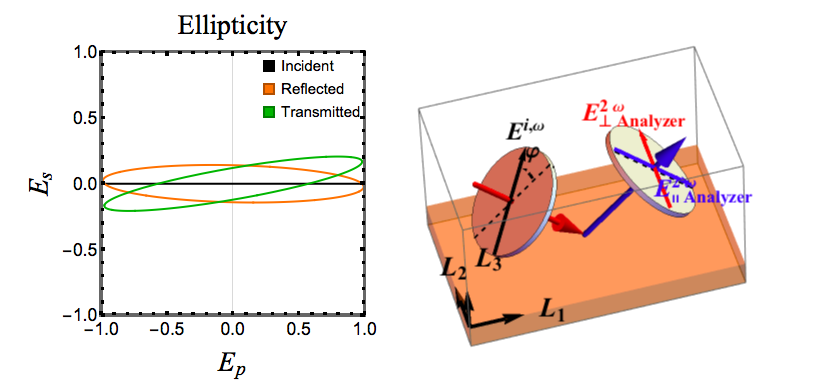
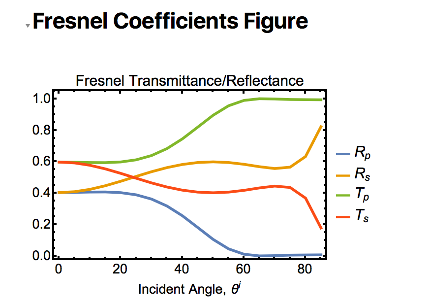
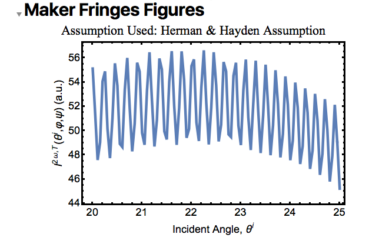
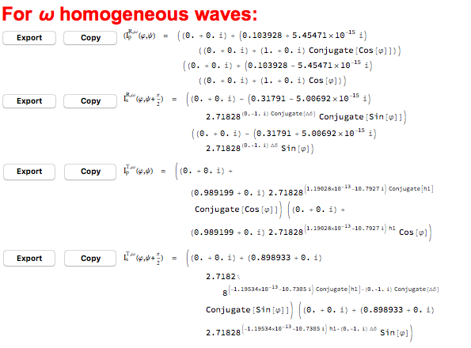
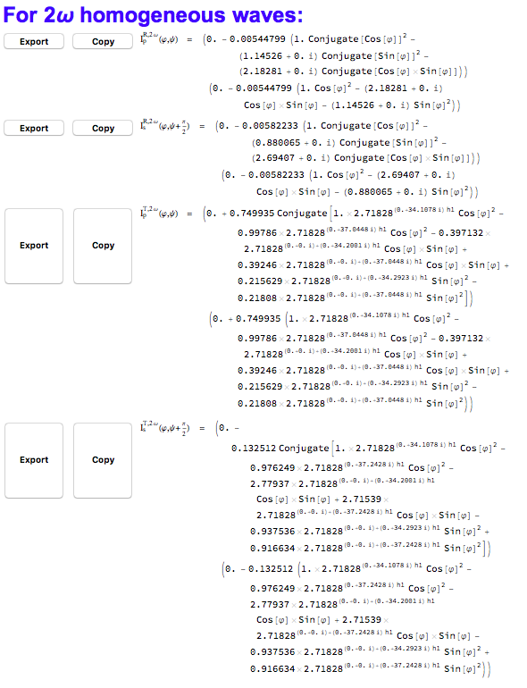
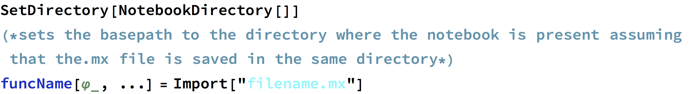

## Output panel

The output panel occupies the major part of the graphical interface. The content shown on the panel depends on the selected functionality. The possible outputs for the various functionalities are detailed below.

!!! note
	Please click on `Update` on the top right corner after specifying the inputs for the changes to take place. 

!!! note
	It is recommended to allow #SHAARP.ml finish running before running any other _Mathematica®_ notebook. 

### Set Material Properties

-  The top figure describes the multilayer geometry. The layer name, Miller indices defining the crystal surface plane, point group and thickness is displayed for each layer.

-  The bottom figure highlights the relative orientation between the crystal physics axes $Z_1 Z_2 Z_3$ and the lab coordinate system $L_1 L_2 L_3$ for the layer selected in the `Material Selection` sub-panel. Note that for a given crystal symmetry, a definite relation exists between the crystal physics axes $Z_i$ and the $a$, $b$, $c$ axes of the crystal. Hence, the figure allows the visualization of the orientation of the selected layer. 
-  Depending on whether `2D Schematic` or `3D Schematic` is selected in the `Functionality` sub-panel, the bottom figure will be two-dimensional or three-dimensional. In case of the latter, the figure is interactive.  

### SHG Simulation

#### Optical geometry and polarization

-  The figure on the top-left presents a schematic of the multiple reflection of waves in the different layers. The topmost and bottommost layers are vacuum/air. 
-  The red rays denote the waves at the fundamental frequency and the blue rays denote the second harmonic waves. The orange waves represent the $2\omega$ inhomogeneous waves reflect the sub-assumption used for full multiple reflections. 

-  The figure on the top-right shows the fundamental incident wavevector $k^{\omega}$ and the plane of incidence in the lab coordinate system (defined by $L_1 L_2 L_3$).

-  The ellipticity of the incident, reflected and transmitted beams are presented in the figure at the bottom-left corner while the measurement geometry is described in the figure on the bottom-right.

#### Polar Plots

-  The sub-panel shows the polar plots of the reflected and transmitted intensities of the second harmonic wave as a function of the incident polarization angle $\varphi$. $\psi$ refers to the analyzer angle. 
-  The assumption used for the calculation is also mentioned. 
-  Buttons are provided to copy the underlying (normalized) expressions to the clipboard which may then be assigned to a *Mathematica®* function having argument `\[CurlyPhi]_`.

!!! note
	$\varphi$ (`\[CurlyPhi]`) can be quickly entered in *Mathematica®* using the alias `Esc-j-Esc`.

#### Fresnel Coefficients Figure

!!! note
	This sub-panel is available only if `Generate Fresnel Coefficients Plot` is checked in the `Calculation Controls` in the input panel.

-  A plot of the calculated Fresnel coefficients in steps of the provided step size is calculated and plotted.  
-  Buttons are also provided to copy the underlying data to compare with experimental values. The values are copied to the clipboard  as a list and may be pasted in a *Mathematica®* notebook.

#### Maker Fringes Figure

!!! note
	This sub-panel is available only if `Generate Maker Fringes Plot` is checked in the `Calculation Controls` found in the input panel.

-  Plots of the calculated SHG intensity $I^{2 \omega}(\theta^i, \varphi, \psi)$ and $I^{2 \omega}(\theta^i, \varphi, \psi+90^{\circ})$ as a function of the incidence angle $\theta^i$ is calculated for fixed incident polarization angle $\varphi$ and fixed analyzer angle $\psi$ as provided in the `Maker Fringes Collection Settings` in the input panel. 
-  The assumption used for the calculation is also mentioned. 
-  Buttons are also provided to copy the data to compare with experiments. The values are copied to the clipboard as a list and may be pasted in a *Mathematica®* notebook.

### Partial Analytical Expressions

-  This panel contains the partial analytical expressions of the fundamental and SHG reflectance and transmittance as a function of the polarizer angle $\varphi$ and the unknown parameters (thickness and/or SHG coefficients) as provided in the `Set Material Properties` tab in the input panel.

-  One may copy the derived analytical expressions by clicking on the `Copy` button and assiging it to a *Mathematica®* function with arguments `\[CurlyPhi]_` and the unknown thicknesses (having form `hk`) and/or SHG coefficients (of the form `dijmk`). 

!!! note
	$\varphi$ (`\[CurlyPhi]`) can be quickly entered in *Mathematica®* using the alias `Esc-j-Esc`.

-   To save the expression to a `.mx` file, click `Export` and give it a suitable name. To load the expression into a *Mathematica®* notebook, use the following code:

   
   
   If the `.mx` file is saved in a different directory from the one where the current notebook is being executed, enter the path of the saved file in the `Import[]` function.

!!! note
	In some cases, the derived expressions are too long to be displayed. In this case, the user can still click `Copy` to copy the full expression.

!!! note
	While `Partial Analytical Expression` is best used for getting the SHG intensities when unknown thicknesses and/or SHG tensor elements are given, it can also be used to extract the expressions used for plotting the polar plots (for known thicknesses and SHG coefficients). The expressions may differ from the expressions obtained using the `Copy` button below the SHG polar plots by a normalization factor.

!!! note
	The derived expressions are unsimplified; use `Simplify[]` or `FullSimplify[]`to simplify these expressions after copying if needed.

